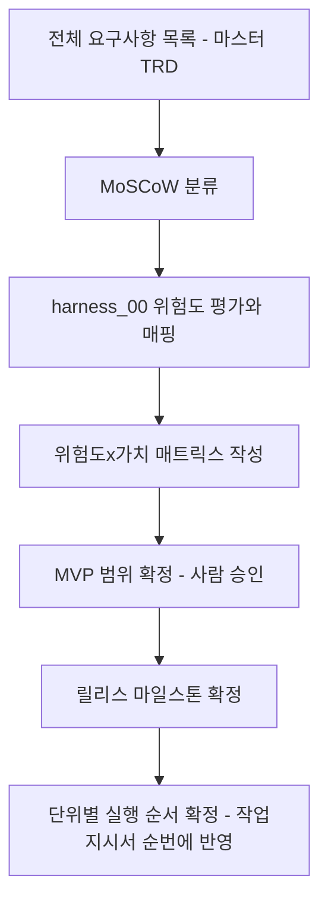

# 릴리스/우선순위 계획 (Release & Priority Planning)

> 목적: `harness_00`의 실행 순서는 "위험도"만 기준으로 삼습니다. 하지만 위험도가
> 낮아도 비즈니스 가치가 낮은 기능을 먼저 만들면 정작 필요한 기능은 늦게
> 나옵니다. 이 문서는 "가치" 축을 별도로 정의해서 위험도와 함께 실행 순서를
> 최종 확정합니다.

---

## 문서 정보
- 프로젝트: [ ]
- 작성일 / 버전: [ ]

## §1. MoSCoW 분류 [사람 작성]
> 전체 기능 목록(마스터 TRD 기준)을 아래 4단계로 분류합니다.

| 단위 코드 | 기능명 | 분류 (Must/Should/Could/Won't) | 분류 근거 |
|---|---|---|---|
| | | | |

- **Must**: 이게 없으면 시스템이 목적을 달성 못함 (예: 로그인, 핵심 업무 기능 자체)
- **Should**: 중요하지만 1차 출시 이후로 미뤄도 서비스 자체는 굴러감
- **Could**: 있으면 좋지만 없어도 무방
- **Won't**: 이번 릴리스 범위에서 명시적으로 제외 (나중에 재검토)

## §2. MVP 범위 확정 [사람 작성 — 최종 승인 필요]
- 1차 출시(MVP)에 포함되는 단위: (Must 전체 + Should 일부)
- 제외 사유가 명확해야 함 — "그냥 나중에"가 아니라 왜 미루는지 기록

## §3. 위험도 × 가치 매트릭스 [AI 초안 가능 → 사람 확정]

```mermaid
quadrantChart
    title 위험도 x 가치 매트릭스 - 실행 순서 결정
    x-axis 낮은 가치 --> 높은 가치
    y-axis 낮은 위험도 --> 높은 위험도
    quadrant-1 먼저 한다 (가치高 위험高)
    quadrant-2 두번째 (가치低 위험高 - 구조를 먼저 굳힘)
    quadrant-3 나중에 (가치低 위험低)
    quadrant-4 세번째 (가치高 위험低)
```

> 각 단위를 위 매트릭스의 사분면 중 어디에 놓을지 판단한 뒤, 실행 순서
> (작업지시서 순번)에 반영하세요. 아래 §3-1 채점표로 "위험도" 점수를 먼저
> 매기고, 그 점수를 y축에 반영하세요.

### §3-1. 위험도 채점 기준표 [사람 작성 — 단위별로 채점]

> "위험도"를 감으로 매기면 사람마다 기준이 달라져 매트릭스가 주관적으로
> 채워집니다. 아래 4개 항목을 각 1~3점으로 채점해 합산하세요 (최소 4점,
> 최대 12점). 합산 8점 이상이면 "높은 위험도"로 분류하고, 반드시
> `harness_08_adr.md`에 결정 근거를 남기세요.

| 항목 | 1점 | 2점 | 3점 |
|---|---|---|---|
| 되돌리기 난이도 | 코드만 롤백하면 원상복구 | 데이터 마이그레이션 필요 | 데이터모델/권한구조처럼 구조적 변경 (`harness_00 §4-1` 대상) |
| 영향 범위 | 이 단위 내부로 한정 | 다른 단위 1~2개가 이 단위의 산출물(API/테이블)에 의존 | 시스템 전반 또는 전체 사용자에게 영향 |
| 기술적 불확실성 | 팀이 이미 여러 번 써본 방식 | 처음 써보는 라이브러리/패턴이지만 검증된 사례 있음 | 외부 연동/신기술이라 실패 시 대안이 불명확 |
| 개인정보·보안 민감도 | 개인정보 미포함 | 개인정보 포함하나 `harness_10` 표준 마스킹으로 충분 | 민감정보(주민번호급) 또는 결제/인증 정보 포함 |

| 단위 코드 | 되돌리기 | 영향범위 | 기술불확실성 | 개인정보 | 합계 | 분류 |
|---|---|---|---|---|---|---|
| | | | | | | |

> 합산 점수는 참고 기준이지 기계적 확정이 아닙니다 — 점수가 낮아도 사람이
> 보기에 위험하다고 판단되면 상향 조정한 근거를 이 표 옆에 기록하세요
> (`harness_00 §4-5` "AI의 판단 근거를 기록하게 한다"와 동일 원칙을
> 사람 판단에도 적용).

## §4. 릴리스 마일스톤 [사람 작성]

| 버전 | 목표일 | 포함 단위 | 상태 | 진행률(완료 단위/전체 단위) | 지연일수 |
|---|---|---|---|---|---|
| v0.1 (MVP) | | | | | |
| v0.2 | | | | | |

> "지연일수"는 목표일 대비 실제(또는 현재 예상) 완료일의 차이입니다. 지연이
> 누적되면 `harness_11 RACI`의 Product Owner에게 조기 보고하세요 — 목표일
> 당일에야 지연을 알게 되는 것을 방지하기 위함입니다.

## §5. 계획 수립 절차



## §6. 갱신 시점
- 마스터 TRD가 바뀔 때 (`harness_12` 변경관리 프로세스로 트리거된 경우)
- 마일스톤 완료 시점마다 다음 마일스톤 재확인
