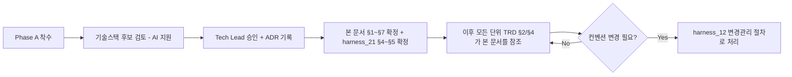

# 전역 기술 컨벤션 (Global Technical Conventions)

> 목적: 각 단위 TRD의 §2(함수/API 명세)는 단위별로 개별 정의됩니다. 이 문서가
> 없으면 AI 세션마다, 단위마다 API 응답 포맷/에러 코드 체계/네이밍이 미묘하게
> 달라져서 나중에 프론트/백엔드 통합 시점에 조립되지 않는 부품들이 나옵니다.
> **Phase A(프로젝트 착수)에서 1회 확정**하고, 이후 모든 단위 TRD는 이 문서를 따릅니다.

---

## §1. 기술 스택 [사람 작성 — ADR 링크]
- 언어/프레임워크:
- 데이터베이스:
- 관련 ADR:
- 로컬 개발환경 셋업 절차: (신규 참여자가 로컬에서 프로젝트를 띄우기까지의
  단계 — 저장소 clone부터 첫 실행까지. 1인 프로젝트에서는 낮은 우선순위지만,
  본인이 몇 달 뒤 다시 셋업할 때도 그대로 도움이 됨)
  - 저장소 접근 방법: (예: SSH 키 등록 또는 HTTPS+PAT 중 어떤 방식을
    쓰는지, collaborator 권한은 누구에게 요청하는지 — **실제 키/토큰 값은
    여기에도 어디에도 저장소 안에 저장하지 않는다.** SSH 키는 `~/.ssh/`,
    HTTPS PAT는 Git Credential Manager/OS 자격증명 관리자에 등록해
    사용한다. 저장소 폴더 안(gitignore 여부와 무관하게)에 실제 접속정보
    파일을 두지 않는 것을 원칙으로 한다 — `harness_05 §3` "네트워크/외부
    접근 절대 넣지 않는다" 원칙과 동일)
  - 필요한 환경변수 목록: 애플리케이션 실행에 필요한 환경변수 **이름**만
    저장소 루트 `.env.example`에 기록(값은 비워둠). 실제 값은 각자
    `.env`(gitignore 대상, 커밋 안 됨)에 로컬로만 채운다
- MCP 서버 연동: (사용 중인 MCP 서버가 있다면 이름/용도/설정 위치를 기록 —
  예: 프로젝트 `.mcp.json`. 없으면 "해당 없음"으로 명시)
  - 도입 전 출처/권한 범위 검토자: MCP 서버는 임의 코드 실행·외부 네트워크
    통신이 가능한 확장 지점이므로, "기록"만으로 끝내지 말고 도입 전 누가
    출처(공식/커뮤니티 여부, 소스 공개 여부)와 요청 권한 범위(최소 권한
    원칙 준수 여부)를 검토했는지 명시 — `harness_11 RACI`의 보안 담당자
    또는 Tech Lead

## §2. API 설계 표준
- URL 네이밍 규칙:
- HTTP 메서드 사용 규칙:
- 요청/응답 공통 포맷:
- 에러 응답 공통 포맷 (모든 단위 TRD §4가 이 포맷을 따름):
- 버저닝 정책:

## §3. 인증/인가 공통 방식 [사람 작성 — ADR 링크]
- 인증 방식:
- 권한/역할 구조 (모든 단위 TRD §0-1 "권한" 항목이 참조):

**인증 보안 하위 체크리스트** [사람 작성 — 해당 없음이면 "N/A"로 명시]
> `harness_01 §0-1` "보안(인증 외)"는 인증 자체를 범위 밖으로 두므로, 인증
> 관련 보안 결정은 반드시 여기서 명시적으로 확정한다. 빈칸으로 남기면
> `harness_06 §3` "보안 정책이 기술스택 결정보다 늦게 채워짐" 실패 패턴이
> 재발한다.
- 비밀번호 정책/해싱 알고리즘: (예: 최소 길이·복잡도 기준, bcrypt/argon2 등)
- 로그인 실패 제한(brute-force 방어): (예: N회 실패 시 잠금/지연시간)
- 세션·토큰 만료 시간:
- 다단계 인증(MFA) 적용 여부:
- 쿠키 보안 속성: (HttpOnly/Secure/SameSite 적용 여부)

## §4. 코딩 컨벤션
- 네이밍 규칙 (변수/함수/파일):
- 디렉토리 구조:
- 주석/문서화 규칙:
- 정적 분석/포맷팅/타입체크 도구: (예: ESLint+Prettier / Ruff+mypy 등 — 스택 확정 후
  CI `lint` 잡에 편입)
- 품질 게이트 기준: (예: lint/format 실패 시 머지 차단. 타입체크 경고는 즉시
  차단할지 `harness_16` 기술부채로 등록 후 넘어갈지 사람이 확정)

## §5. 로깅/에러 처리 표준
- 로그 포맷:
- 로그 레벨 기준:
- 개인정보가 로그에 남지 않도록 하는 규칙 (`harness_10` 연동):
- 로거 초기화/핸들러 설정 위치 및 확인 방법 [빈칸 금지 — `harness_19 §1` 필수
  필드]: 애플리케이션 진입점에서 로깅 레벨/핸들러가 명시적으로 설정됐는지
  명시하고, 실제 실행 환경(로컬 개발환경뿐 아니라 컨테이너 등 배포 환경
  포함)에서 각 레벨(info/debug/warning/error)이 실제로 출력되는지 최초
  셋업 시 반드시 확인한다. 언어/프레임워크의 로깅 라이브러리가 기본으로
  제공하는 "최후 폴백 핸들러"가 일부 레벨(흔히 warning 이상)만 우연히
  출력해서 "로깅이 되고 있다"고 착각하게 만드는 경우가 있다 — `harness_06 §3`
  "로거 미설정으로 인한 침묵 로그" 실패 패턴 참조.
- 단계별 소요시간 로깅: 특히 API 요청 처리·배치 작업처럼 여러 단계로
  구성된 처리는 각 단계 시작/종료 시각 또는 소요시간을 로그에 남겨서,
  나중에 "왜 느려졌는지"를 재현 없이 로그만으로 원인 구간을 추적할 수
  있게 한다 (`harness_17_monitoring.md §1` "응답시간" 항목과 연동).

## §6. 커밋/PR 컨벤션
- `harness_05 §1`의 브랜치/커밋 규칙을 그대로 따름 (여기서 중복 정의하지 않음).

## §7. 의존성/공급망 보안 [사람 작성 — 스택 확정 후]
> 코드에 시크릿이 없는지는 CI의 gitleaks가 잡아준다(`harness_05 §2`). 하지만
> 가져다 쓰는 외부 패키지 자체에 알려진 취약점이 있거나, 라이선스가 프로젝트
> 배포 방식과 충돌하는 경우는 별도로 막아야 한다.

- 의존성 취약점 스캔 도구: (예: `npm audit`/`pip-audit`/`osv-scanner`/Dependabot 등 —
  스택 확정 후 CI `dependency-scan` 잡에 편입, `harness_05 §2` 참조). Dependabot
  설정 파일은 `.github/dependabot.yml`에 이미 있음 — `github-actions` 항목은
  스택 무관하게 활성 상태이고, 애플리케이션 의존성(npm/pip 등)은 스택 확정
  후 해당 예시의 주석만 해제하면 됨
- 스캔 주기: PR마다(필수) + 정기 스케줄(예: 주 1회, 신규 취약점 공표 대응)
- 심각도 기준 처리 정책: (예: Critical/High 발견 시 머지 차단, Medium 이하는 `harness_16` 기술부채로 등록)
- OSS 라이선스 정책: (예: 배포 방식과 충돌하는 라이선스 사용 금지 — 사람이 확정)
- 관련 ADR:

## §8. 확정 절차
> 프론트엔드/퍼블리싱 컨벤션(반응형·네이밍·디자인토큰·접근성 등)은
> `harness_21_ux_design_process.md` §4~§5를 참조하세요 — 화면이 있는
> 프로젝트는 본 문서와 같은 시점(Phase A)에 함께 확정합니다.

