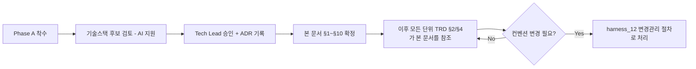

# 전역 기술 컨벤션 (Global Technical Conventions)

> 목적: 각 단위 TRD의 §2(함수/API 명세)는 단위별로 개별 정의됩니다. 이 문서가
> 없으면 AI 세션마다, 단위마다 API 응답 포맷/에러 코드 체계/네이밍이 미묘하게
> 달라져서 나중에 프론트/백엔드 통합 시점에 조립되지 않는 부품들이 나옵니다.
> **Phase A(프로젝트 착수)에서 1회 확정**하고, 이후 모든 단위 TRD는 이 문서를 따릅니다.

---

## §1. 기술 스택 [사람 작성 — ADR 링크]
- 언어/프레임워크:
- 데이터베이스:
- 관련 ADR:
- 로컬 개발환경 셋업 절차: (신규 참여자가 로컬에서 프로젝트를 띄우기까지의
  단계 — 저장소 clone부터 첫 실행까지. 1인 프로젝트에서는 낮은 우선순위지만,
  본인이 몇 달 뒤 다시 셋업할 때도 그대로 도움이 됨)

## §2. API 설계 표준
- URL 네이밍 규칙:
- HTTP 메서드 사용 규칙:
- 요청/응답 공통 포맷:
- 에러 응답 공통 포맷 (모든 단위 TRD §4가 이 포맷을 따름):
- 버저닝 정책:

## §3. 인증/인가 공통 방식 [사람 작성 — ADR 링크]
- 인증 방식:
- 권한/역할 구조 (모든 단위 TRD §0-1 "권한" 항목이 참조):

## §4. 코딩 컨벤션
- 네이밍 규칙 (변수/함수/파일):
- 디렉토리 구조:
- 주석/문서화 규칙:
- 정적 분석/포맷팅/타입체크 도구: (예: ESLint+Prettier / Ruff+mypy 등 — 스택 확정 후
  CI `lint` 잡에 편입)
- 품질 게이트 기준: (예: lint/format 실패 시 머지 차단. 타입체크 경고는 즉시
  차단할지 `harness_16` 기술부채로 등록 후 넘어갈지 사람이 확정)

## §5. 로깅/에러 처리 표준
- 로그 포맷:
- 로그 레벨 기준:
- 개인정보가 로그에 남지 않도록 하는 규칙 (`harness_10` 연동):

## §6. 커밋/PR 컨벤션
- `harness_05 §1`의 브랜치/커밋 규칙을 그대로 따름 (여기서 중복 정의하지 않음).

## §7. 의존성/공급망 보안 [사람 작성 — 스택 확정 후]
> 코드에 시크릿이 없는지는 CI의 gitleaks가 잡아준다(`harness_05 §2`). 하지만
> 가져다 쓰는 외부 패키지 자체에 알려진 취약점이 있거나, 라이선스가 프로젝트
> 배포 방식과 충돌하는 경우는 별도로 막아야 한다.

- 의존성 취약점 스캔 도구: (예: `npm audit`/`pip-audit`/`osv-scanner`/Dependabot 등 —
  스택 확정 후 CI `dependency-scan` 잡에 편입, `harness_05 §2` 참조)
- 스캔 주기: PR마다(필수) + 정기 스케줄(예: 주 1회, 신규 취약점 공표 대응)
- 심각도 기준 처리 정책: (예: Critical/High 발견 시 머지 차단, Medium 이하는 `harness_16` 기술부채로 등록)
- OSS 라이선스 정책: (예: 배포 방식과 충돌하는 라이선스 사용 금지 — 사람이 확정)
- 관련 ADR:

## §9. 프론트엔드/퍼블리싱 컨벤션 [사람 작성 — 화면이 있는 프로젝트만]
> 화면이 없는(배치/API 전용) 프로젝트는 이 섹션 전체를 "N/A"로 명시하세요.
> 있는데 비워두면 세션마다 마크업 스타일이 달라져, §2가 막으려는 문제
> ("API 포맷이 세션마다 미묘하게 달라져 조립이 안 됨")가 프론트 쪽에서
> 그대로 재현됩니다.

- 반응형 브레이크포인트: (기본값 예시 — 모바일 <768px / 태블릿 768~1024px /
  데스크톱 >1024px. 프로젝트 실제 사용자 기기 통계에 맞춰 조정)
- CSS/컴포넌트 네이밍 규칙: (기본값 예시 — BEM: `Block__Element--Modifier`)
- 디자인 토큰: 색상/타이포그래피/간격(spacing) 값을 변수(CSS 커스텀 프로퍼티
  등)로 정의하고 하드코딩 금지. 원본은 Phase A-2 화면설계 산출물을 따름
  (`harness_00_overview.md` Phase A 참조)
- 컴포넌트 재사용 전략: 공통 컴포넌트 위치와 중복 마크업 금지 원칙
- 크로스브라우저 지원 범위: (기본값 예시 — 최신 2개 메이저 버전. 구형 브라우저
  지원이 필요하면 프로젝트 요구사항에 명시)
- 에셋 최적화: 이미지 포맷/압축 기준, 폰트 서브셋팅 여부
- 다국어(i18n): 다국어 지원 여부 및 텍스트 하드코딩 금지 규칙 (단일 언어면
  "단일 언어(한국어)"로 명시)

## §10. 접근성(Accessibility) 기준 [사람 작성 — 화면이 있는 프로젝트만]
> TRD §0-1 비기능요구사항이나 배포 체크리스트(`harness_09 §2`) 어디에도
> 접근성이 없으면, "만들고 나서 감사에서 걸림" 리스크가 있습니다. 특히
> 공공/교육기관 대상 프로젝트는 접근성이 법적 요구사항인 경우가 많습니다.

- 목표 등급: (기본값 예시 — WCAG 2.1 AA. 국내 공공/교육 대상이면 KWCAG 2.2
  준수 여부를 사람이 확정)
- 최소 체크리스트 (단위 완료 시 `harness_00_overview §6` 품질 게이트에서 함께 확인):
  - [ ] 이미지에 대체텍스트(alt) 제공
  - [ ] 키보드만으로 모든 기능 조작 가능
  - [ ] 색상만으로 정보를 전달하지 않음 (텍스트 명도 대비 4.5:1 이상)
  - [ ] 폼 요소에 label이 연결되어 있음
  - [ ] 의미 없는 `
` 남용 대신 시맨틱 HTML 태그 사용
- 검증 시점: 단위 배포 전 체크리스트(`harness_09 §2`)에서 통과 여부 확인

## §11. 확정 절차

