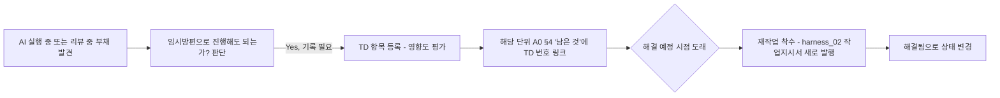

# 기술 부채 로그 (Technical Debt Log)

> 목적: A0 인수인계 문서 §3(편차)는 "몰랐는데 다르게 나온 것"을 기록합니다.
> 반면 기술부채는 "알면서 의도적으로 미룬 것"입니다. 이 둘을 섞으면 A0가
> 지저분해지고, 미룬 것들이 시간이 지나면 아무도 기억 못해서 영원히 안 고쳐집니다.

---

## §1. 기술부채 항목

| ID | 등록일 | 단위 | 내용 | 왜 미뤘는가 | 영향도(상/중/하) | 해결 예정 시점 | 상태 |
|---|---|---|---|---|---|---|---|
| TD-001 | 2026-09-09 | `harness_05_execution_infra.md §3`(지속 메모리 신뢰 검증, ASI06) | "정기 검토 주기"와 "이상 발견 시 폐기 담당자"가 `[사람 작성]`으로 비어 있음 — 초안취급·출처구분 원칙만 고정된 상태 | 검토 주기·담당자는 프로젝트 규모/메모리 기능 사용 빈도에 따라 값이 크게 달라져 하네스(범용 템플릿) 단계에서 임의로 확정하면 오히려 실제 운영과 안 맞을 위험이 있어 프로젝트별 결정으로 남김 | 중 | 각 프로젝트 Phase A 착수 시 — 특히 세션-간 자동 메모리 기능을 적극 쓸 계획이면 착수 즉시 필수 | 미해결 |
| TD-002 | 2026-09-09 | `harness_05_execution_infra.md §3`(AI 코딩 에이전트 행동 기준선/킬스위치, ASI10) | "행동 기준선(무엇이 정상 행동인지)"의 구체값이 `[사람 작성]`으로 비어 있음 — 즉시중단 권한 원칙만 고정된 상태 | 정상 행동 기준은 프로젝트가 쓰는 AI 도구·워크플로우마다 다르며(허용 파일 범위, 반복 재시도 임계치 등), 범용 템플릿 단계에서 구체 수치를 정하면 실제 프로젝트에 안 맞을 위험 | 중 | 각 프로젝트 Phase A 착수 시 — 특히 다중 에이전트 병렬 실행(`harness_15`)을 쓸 계획이면 착수 즉시 필수 | 미해결 |
| TD-003 | 2026-09-09 | `harness_15_parallel_work.md §6`(에이전트 간 통신 신뢰 원칙, ASI07) | "신원 식별 규칙"과 "통신 무결성 검증 절차"가 `[사람 작성]`으로 비어 있음 — 미검증 입력 취급·권한위임 최소화 원칙만 고정된 상태 | 신원 식별 태그 규칙과 통신 무결성 요구 수준(민감정보 포함 여부 등)은 프로젝트별 병렬 세션 운영 방식에 따라 달라 하네스 단계에서 획일적으로 정하기 어려움 | 중 | 각 프로젝트에서 `harness_15` 병렬 작업을 실제로 착수할 때 필수(병렬 작업을 안 쓰면 `harness_19 §4`에 따라 생략 가능) | 미해결 |

## §2. 등록/해소 절차

## §3. 검토 주기
- 각 마일스톤 완료 시 미해결 TD 목록을 훑고 다음 마일스톤에 반영할지 재평가
  (`harness_07` 연동)
- **(선택) Claude Code 사용자**: 매주 자동으로 "해결 예정 시점이 지난 미해결
  TD"를 감사하는 클라우드 routine을 설정할 수 있습니다(읽기 전용, 파일
  수정·git 실행 없음 — `/schedule`로 생성). 사람이 놓치기 쉬운 "해결 예정
  시점이 지났는데 아무도 안 봄" 상황을 잡아줍니다. 결과는 자동으로 알림이
  오지 않으니(연결된 알림 채널이 없다면) `claude.ai/code/routines`에서
  직접 확인해야 합니다.
