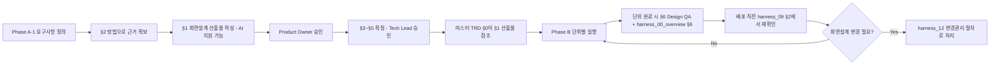

# UX/디자인 프로세스 (UX & Design Process)

> 목적: 기존 SOP(`harness_00_overview.md` Phase A)는 요구사항 정의 다음
> 바로 데이터모델로 넘어갔습니다. 화면 시안이 없는 채로 TRD/AC부터 확정하면,
> 나중에 화면이 바뀔 때 이미 확정한 AC까지 같이 흔들립니다. 그리고
> `harness_13_tech_conventions.md`는 API/네이밍 등 **백엔드** 컨벤션만
> 다뤄서, 프론트/퍼블리싱 쪽은 세션마다 마크업 스타일이 달라져 조립이 안
> 되는 문제가 그대로 남아 있었습니다. 이 문서는 그 두 공백(화면설계 프로세스
> + 프론트/퍼블리싱 컨벤션)을 하나로 묶어 다룹니다.
> **Phase A-2(화면설계 확정)에서 §1~§3을 채우고, §4~§5는 Phase A-4(전역
> 기술 컨벤션 확정)와 같은 시점에 `harness_13`과 함께 확정합니다.**

---

## §1. 화면설계 산출물 관리 [사람 작성 — Phase A-2에서 확정, 사람 승인 필수]
> `harness_00_overview.md` Phase A-2의 실제 산출물이 여기 기록됩니다. 이
> 산출물이 승인되기 전에는 마스터 TRD §0(화면/기능 흐름)을 확정하지 마세요.

- 정보구조(IA) 산출물 위치:
- 와이어프레임/프로토타입 도구 및 산출물 위치: (예: Figma 링크, 또는 저장소 내 경로)
- 승인권자: `harness_11_raci.md`의 Product Owner
- 승인 후 변경이 필요해지면: `harness_12_change_management.md` 변경관리 절차로 처리
  (이미 확정된 단위 TRD/AC에 영향이 있는지 반드시 함께 확인)

## §2. 요구사항 도출 방법 [사람 작성]
> `harness_00_overview.md` Phase A-1 "요구사항 정의"가 근거 없이 감으로
> 이뤄지는 것을 막기 위한 절차입니다. 최소 하나는 실제로 수행하고 그 결과를
> 기록하세요.

- 사용한 방법 (하나 이상 선택): 사용자 인터뷰 / 유사 서비스 벤치마킹 /
  이해관계자 워크숍 / 기타( )
- 방법별 결과 기록 위치:
- 요구사항과 근거의 연결: 마스터 TRD 또는 §1 화면설계 산출물에 "왜 이 기능이
  필요한가"가 위 근거를 통해 역추적 가능해야 함

## §3. 디자인 시스템 (토큰/컴포넌트) [사람 작성 — 화면이 있는 프로젝트만]
- 디자인 토큰(색상/타이포그래피/간격): §1 화면설계 산출물에서 정의된 값을
  따르며, 코드에는 변수(CSS 커스텀 프로퍼티 등)로만 반영하고 하드코딩 금지
- 컴포넌트 재사용 전략: 공통 컴포넌트는 `src/components`(또는 프로젝트
  컨벤션 경로)에 두고, 동일 마크업이 2회 이상 반복되면 컴포넌트로 추출
- 토큰/컴포넌트 변경 승인권자: `harness_11_raci.md`의 Product Owner 또는
  Tech Lead(범위에 따라)

## §4. 프론트엔드/퍼블리싱 컨벤션 [사람 작성 — 화면이 있는 프로젝트만]
> 화면이 없는(배치/API 전용) 프로젝트는 이 섹션 전체를 "N/A"로 명시하세요.
> 있는데 비워두면 세션마다 마크업 스타일이 달라져, `harness_13 §2`가 막으려는
> 문제("API 포맷이 세션마다 미묘하게 달라져 조립이 안 됨")가 프론트 쪽에서
> 그대로 재현됩니다.

- 반응형 브레이크포인트: 모바일 <768px / 태블릿 768~1024px / 데스크톱
  >1024px (기본값 — 프로젝트 실사용자 기기 통계 확인 후 조정)
- CSS/컴포넌트 네이밍 규칙: BEM(`Block__Element--Modifier`) 기본 적용
- 크로스브라우저 지원 범위: 최신 2개 메이저 버전(Chrome/Edge/Safari/Firefox)
  기본 지원. 구형 브라우저(IE 등) 지원이 필요하면 프로젝트 요구사항에 별도 명시
- 에셋 최적화: 이미지는 WebP 우선 사용(미지원 환경은 원본 포맷 fallback),
  압축 목표는 원본 대비 70% 이하 용량. 웹폰트는 실제 사용 글리프만 서브셋팅
- 다국어(i18n): 기본값 "단일 언어(한국어)". 다국어 지원 시 텍스트를 코드에
  하드코딩하지 않고 리소스 파일(JSON 등)로 분리

## §5. 접근성(Accessibility) 기준 [사람 작성 — 화면이 있는 프로젝트만]
> TRD §0-1 비기능요구사항이나 배포 체크리스트(`harness_09 §2`) 어디에도
> 접근성이 없으면, "만들고 나서 감사에서 걸림" 리스크가 있습니다. 특히
> 공공/교육기관 대상 프로젝트는 접근성이 법적 요구사항인 경우가 많습니다.

- 목표 등급: WCAG 2.1 AA 기본 적용. 공공/교육기관 대상이면 KWCAG 2.2 준수까지
  확장할지 사람이 최종 확정
- 최소 체크리스트 (단위 완료 시 `harness_00_overview §6` 품질 게이트에서 함께 확인):
  - [ ] 이미지에 대체텍스트(alt) 제공
  - [ ] 키보드만으로 모든 기능 조작 가능
  - [ ] 색상만으로 정보를 전달하지 않음 (텍스트 명도 대비 4.5:1 이상)
  - [ ] 폼 요소에 label이 연결되어 있음
  - [ ] 의미 없는 `
` 남용 대신 시맨틱 HTML 태그 사용
- 검증 시점: 단위 배포 전 체크리스트(`harness_09 §2`)에서 통과 여부 확인

## §6. Design QA 절차
> 구현물이 §1에서 승인된 화면설계와 실제로 일치하는지 검증하는 절차입니다.
> AC(`harness_01 §5`)는 기능 정확성만 보고, 시각적 정확성은 검증 대상 밖이라
> 이 절차가 따로 필요합니다.

- 검증 시점: 단위 완료 시(`harness_00_overview §6`) + 배포 직전(`harness_09 §2`)
- 검증 방법: (예: 확정 시안과 구현 화면 스크린샷 대조, 또는 디자인 도구의
  QA 플러그인 활용)
- 불일치 발견 시: 사소한 차이는 재작업(`feature/{단위코드}-rework`)으로
  처리하고, 시안 자체를 바꿔야 한다면 §1 산출물 갱신 + `harness_12`
  변경관리 절차로 처리

## §7. 확정 절차

