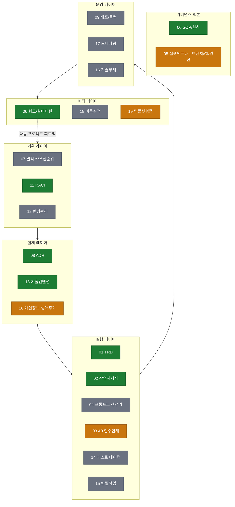
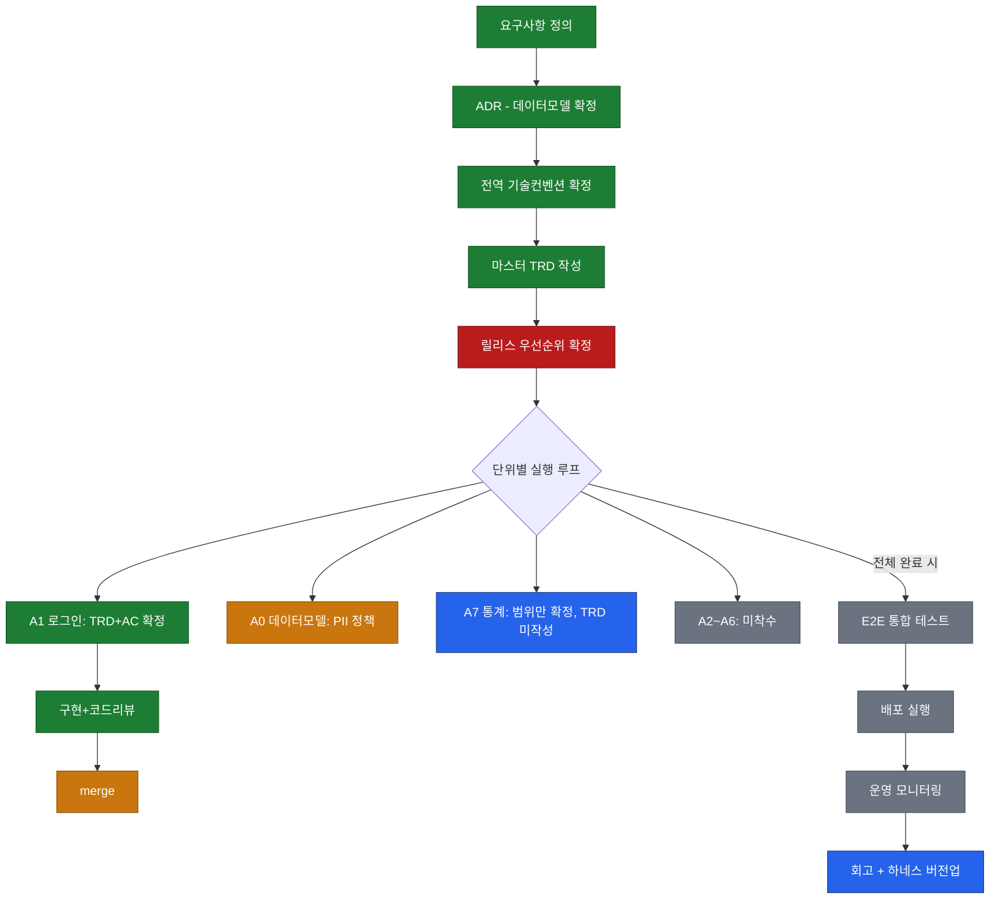
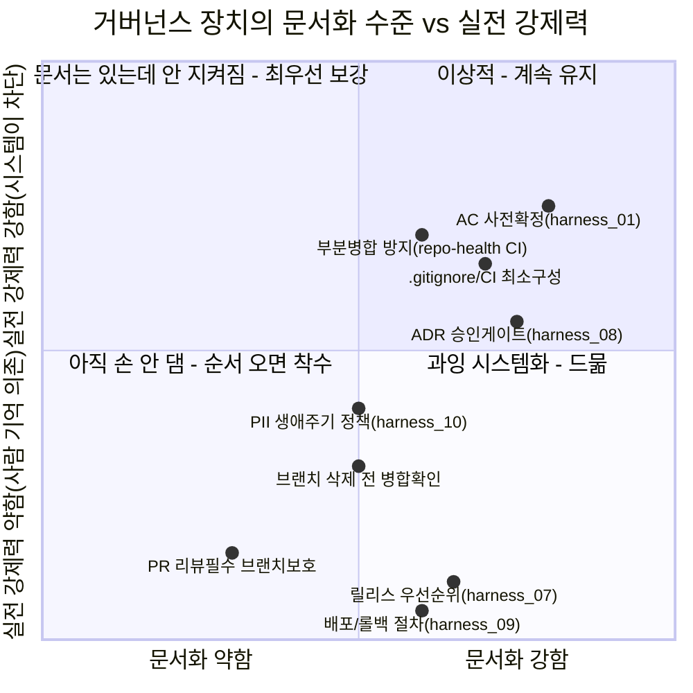

# 하네스 시스템 종합 검토 (20년차 개발/기획/설계 관점) — 2026-09-05

> 대상: `harness/` 20종 문서 + attendance-app 프로젝트에 실제 적용한 결과.
> 목적: "문서상 완성"과 "실전에서 작동함"은 다르다 — 오늘 하루 실제로 벌어진
> 사고(dangling commit 소실 위험 등)를 근거로 하네스 절차 전체를 다시 그려보고,
> 어디가 문서만 있고 어디가 실제로 검증됐는지 표시한다.

---

## 총평 (한 줄)

**문서 설계는 20년차 기준으로도 이례적으로 촘촘하다. 하지만 오늘 실전에서 뚫린
구멍은 전부 "문서에 없는 규칙"이 아니라 "문서에 있었는데 강제되지 않은 규칙"
이었다.** 즉 지금 하네스의 가장 시급한 과제는 문서를 더 쓰는 게 아니라, 이미
적어놓은 규칙을 사람 기억이 아니라 시스템(브랜치 보호, CI, PR 템플릿)이
강제하게 만드는 것이다.

---

## 1. 하네스 전체 구조 지도 — 실전 검증 상태로 재색칠

`harness_00_definition.md` §2의 지도를 그대로 쓰되, 이번 프로젝트에서 실제로
"써봤고 작동을 확인한" 문서(초록)와 "적어만 놓고 실전에서 안 뚫려본" 문서(회색),
"오늘 실전에서 구멍이 발견돼 즉시 보강한" 문서(주황)를 구분했다.

**범례**
- 🟢 초록(verified): 실전에서 실제로 사용됐고 결과물이 base 브랜치에 존재 확인됨 (00, 01, 02, 08, 11, 13, 06)
- 🟠 주황(fixed): 오늘 감사에서 공백/사고가 발견돼 그 자리에서 즉시 보강함 (03 handoff 소급작성, 05 repo-health CI 추가, 10 PII 정책 확정, 19 저장소 상태 자동검증 보완)
- ⚪ 회색(gray): 아직 이 프로젝트가 도달하지 않은 단계라 미검증 (07, 09, 12, 14, 15, 16, 17, 18) — "나쁨"이 아니라 "아직 순서가 안 옴"

---

## 2. Phase A → B → C 표준 절차 — 이 프로젝트 실제 진척으로 재표시

**주목할 점**: A5(릴리스 우선순위 확정, `harness_07`)가 빨간색(스킵됨)이다. A1을
"위험도 1순위"로 바로 착수했는데, 이건 `harness_07`이 요구하는 "MoSCoW 확정 →
그 위에 위험도"라는 순서를 건너뛴 것이다. 결과적으로 A1이 맞는 선택이긴 했지만
(로그인 없이는 아무것도 못 하므로), **운이 좋았던 것이지 절차를 지킨 결과가
아니다** — 다음 프로젝트에서는 이 순서를 실제로 강제할 필요가 있다.

---

## 3. 오늘 실제로 벌어진 일 — dangling commit 소실 위험 사고 시퀀스

이론(§1, §2)이 아니라 **오늘 하루 실제로 일어난 일**을 시퀀스로 남긴다. 20년차
관점에서 이런 "장애 재구성 다이어그램"이 문서 지도보다 훨씬 값어치가 크다 —
다음에 같은 패턴이 보이면 바로 알아챌 수 있게 하는 게 목적이다.

```mermaid
sequenceDiagram
    autonumber
    participant AI as AI 세션(A1 구현)
    participant GH as GitHub 저장소
    participant P as 사람

    AI->>GH: feature/a1-login에 구현+코드리뷰 반영 4커밋 push
    P->>GH: PR #6 오픈 (TRD/작업지시서만 반영)
    Note over GH: 실제 git merge가 아니라<br/>문서 파일만 골라 반영된 정황
    GH-->>P: PR #6 "머지 완료"로 표시
    P->>GH: feature/a1-login 브랜치 삭제 (병합됐다고 믿음)
    Note over GH: ⚠️ 이 시점부터 소스코드는<br/>어떤 브랜치에도 연결 안 됨
    rect rgb(80, 20, 20)
    Note over GH: git gc가 돌면 영구 소실되는<br/>"dangling commit" 상태 (최대 위험 구간)
    end
    P->>AI: (5시간 후) "하네스 다시 점검해줘"
    AI->>GH: git fsck --no-reflog 실행
    GH-->>AI: dangling commit daef148 발견 (겨우 시간 안에)
    AI->>GH: recovered/a1-login 브랜치로 즉시 고정 + push
    P->>AI: "로컬 브랜치 왜 자꾸 만드나요, 물어보고 하세요"
    Note over AI,P: 피드백 반영 — 이후 브랜치 생성 전 항상 확인
    AI->>GH: PROD에 직접 merge (임시 브랜치 전부 삭제)
    AI->>P: 테스트 12개 통과 확인, push는 미실행(사람 지시 대기)
```

**이 사고에서 뽑히는 3개의 구조적 교훈**
1. "PR이 머지됐다"는 GitHub 화면 표시만으로는 부족하다 — `git merge-base
   --is-ancestor`로 실제 조상관계를 확인하는 습관/자동화가 없으면 부분병합을
   못 잡아낸다 (오늘 `repo-health` CI 잡으로 자동화함).
2. "미병합 브랜치"와 "삭제된 브랜치"는 심각도가 완전히 다르다 — 전자는 언제든
   되돌릴 수 있지만 후자는 `git gc` 타이밍에 따라 영구 소실될 수 있다. 브랜치
   삭제는 병합 확인 후에만 해야 한다는 규칙이 `harness_05`엔 없었다 (오늘
   `harness_06` 실패 패턴 표에 추가).
3. AI가 "안전한 조치"라고 판단해 브랜치를 만든 것도, 사람 입장에선 "왜 마음대로
   더 복잡하게 만드냐"는 마찰을 낳았다 — 하네스가 AI의 자율성을 어디까지
   허용할지는 "기술적으로 안전한가"뿐 아니라 "사람이 이해할 수 있는 방식인가"도
   기준이어야 한다는 것을 보여준 사례.

---

## 4. 거버넌스 장치 — "문서에 있음" vs "실제로 작동함" 매핑

**읽는 법**: 왼쪽 아래로 갈수록 위험하다. 오늘 사고를 낸 "브랜치 보호 규칙"과
"릴리스 우선순위 확정"이 정확히 왼쪽 아래 사분면에 있다 — 문서화도 약하고
(정확히는: 문서는 있지만 "왜/어떻게 설정하는지" 실행 지침이 얕고) 실전
강제력도 없다. 다음 우선순위는 이 사분면에 있는 항목을 오른쪽 위(2사분면 →
1사분면)로 옮기는 것이다.

---

## 5. 20년차 전문가 총평

### 강점 3가지
1. **위험 분류가 명확하다.** "되돌리기 어려운 결정"(데이터모델/삭제정책/권한구조)을
   따로 떼어 사람 승인 게이트를 건 것(`harness_00 §4-1`, `harness_08`)은 실제
   조직에서 시니어 리드가 하는 것과 동일한 패턴이다. 오늘 PII 정책(ADR-008)도
   이 게이트 덕분에 AI가 임의로 확정하지 않고 후보안만 냈다.
2. **회고 계층(harness_06)이 실제로 살아있다.** 실패 패턴 표가 오늘도 4건이나
   늘었고, 그 표가 실제 CLAUDE.md/PR 템플릿/CI 변경으로 바로 이어졌다 — "회고만
   하고 안 고치는" 조직의 전형적 실패를 피했다.
3. **문서 커버리지가 이례적으로 넓다.** 20종 문서가 기획→설계→실행→운영→메타
   전 생애주기를 빠짐없이 덮는 경우는 실제 스타트업/사내 프로젝트에서도 드물다.

### 리스크 3가지 (심각도순)
1. 🔴 **실행 강제력 부재.** 오늘 사고의 근본 원인. 문서가 아무리 좋아도
   "브랜치 보호 규칙"처럼 사람이 클릭 한 번으로 켜야 하는 설정이 꺼져 있으면
   전부 무력화된다. 문서 계층(Governance)과 실행 계층(Infra) 사이에 "이게 실제로
   켜져 있는지 확인하는 계층"이 없었다.
2. 🟠 **1인 운영 전제가 하네스 전반에 깔려 있다.** RACI(`harness_11`)도 "1인이면
   역할 전환을 스스로 명시하라"고 되어 있는데, 실제로는 그 "모자 바꿔쓰기"가
   기록되지 않았다(PR을 리뷰어 모자로 승인했는지, 그냥 클릭했는지 구분 안 됨).
   1인 프로젝트에서 RACI는 서류가 아니라 매 순간의 자기 점검 습관이어야 실효성이
   있다.
3. 🟡 **"완료" 표시의 신뢰도 문제.** TRD/ADR/작업지시서 여러 곳에서 "확정"·
   "완료"라고 적힌 항목이 실제로는 미반영이었다(A0 컬럼 확정 vs 정책 미결,
   PR 머지 표시 vs 실제 미병합). 상태 라벨을 사람이 수기로 적는 한 이 문제는
   반복된다 — 자동 검증(오늘 추가한 `repo-health`가 첫 걸음)이 계속 필요하다.

### 우선순위 권고 (지금 순서대로)
1. GitHub `PROD_SCH` 브랜치 보호 규칙 켜기 (리뷰 필수 + 상태체크 필수 + 삭제 제한) — 유일하게 사람만 할 수 있는 항목, 가장 시급
2. `harness_07_release_planning.md`를 실제로 한 번 채워보기 — 지금까지 위험도만으로 순서를 정해왔는데 운이 좋았을 뿐임을 §2에서 확인함
3. A2~A6 착수 전, `contact_view_log` 실제 구현 + `harness_14`(테스트 데이터 카탈로그) 최초 작성
4. 배포 전 `harness_09`(배포/롤백 절차)를 최소 1회 실제로 채워서 "말만 있는 문서"에서 벗어나기
5. 프로젝트 1개 완료 시점에 `harness_06` §2 회고 템플릿을 실제로 작성 — 지금까지는 실패 패턴 표만 채웠고 정식 회고는 아직 안 함

---

## 결론

하네스 "설계"는 이미 20년차 기준을 통과한다. 오늘 부족했던 건 설계가 아니라
**설계를 실제로 강제하는 마지막 1미터**(브랜치 보호 규칙, 부분병합 자동 감지,
브랜치 삭제 전 확인)였고, 이 세 가지는 오늘 감사에서 전부 문서/CI로 보강됐거나
사람 결정 대기 중이다. 다음 프로젝트에 이 하네스를 다시 쓴다면, §5 우선순위
권고의 1번(브랜치 보호 규칙)부터 시작하는 것이 가장 비용 대비 효과가 크다.
